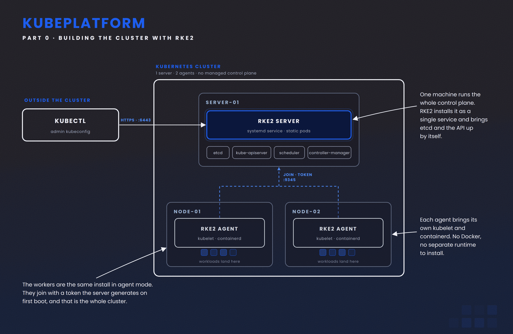

# KubeCore Platform

A GitOps-based Kubernetes platform simulating enterprise infrastructure, hosting and managing core internal services in a fully automated and reproducible environment.

## Stack

* RKE2
* Kubernetes
* Cilium
* Argo CD
* Longhorn
* PostgreSQL
* Prometheus
* Grafana
* Loki
* KVM / libvirt
* Bash
* cloud-init

## Architecture



## Repository

```text
KubeCore-Platform/
├── scripts/
├── vm/
├── rke2/
├── .gitignore
└── README.md
```

## Progress

* [x] Project structure
* [x] VM infrastructure
* [x] VM networking
* [x] Cloud-init
* [ ] RKE2 cluster
* [ ] Cilium
* [ ] Argo CD
* [ ] Platform services
* [ ] Observability
* [ ] Internal applications

## Roadmap

```text
RKE2
  ↓
Cilium
  ↓
Argo CD
  ↓
Platform Services
  ↓
Observability
  ↓
Internal Applications
```

## Goal

Build a reproducible, self-hosted Kubernetes platform managed through GitOps.
