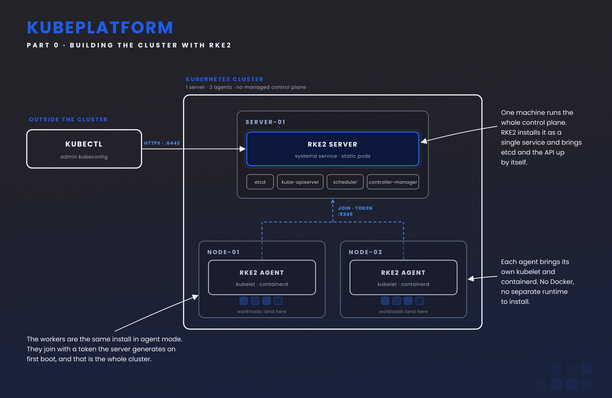

# KubeCore

A homelab Kubernetes platform built on KVM. The goal is a setup close to what you'd run in a company: VMs provisioned with cloud-init, an RKE2 cluster on top, and everything inside the cluster managed through GitOps with Argo CD.

Everything is scripted in Bash, so the lab can be torn down and rebuilt at any time.



## What's in it

The whole thing runs on one Linux host. `scripts/create.sh` sets up:

- a libvirt NAT network, `rke2-lab` on `192.168.50.0/24`
- three Ubuntu 24.04 VMs with static IPs, set up by cloud-init:
  - `cp1` at `192.168.50.10`, the RKE2 server
  - `worker1` at `192.168.50.11`, an RKE2 agent
  - `worker2` at `192.168.50.12`, an RKE2 agent
- RKE2 on all three nodes, with the workers joined to `cp1`

Each VM gets 2 vCPUs, 2 GB of RAM and a 10 GB disk. You can change this in `config.env`.

Planned next: Cilium, Argo CD, Longhorn, PostgreSQL, then Prometheus, Grafana and Loki for monitoring.

## Requirements

- Linux with KVM enabled
- libvirt, `virt-install`, `qemu-img`, `cloud-localds`
- an SSH key at `~/.ssh/id_ed25519.pub`. It gets copied into every VM.
- about 6 GB of free RAM

On Fedora:

```bash
sudo dnf install @virtualization cloud-utils
sudo systemctl enable --now libvirtd
sudo usermod -aG libvirt "$USER"
```

On Debian or Ubuntu, install `qemu-kvm libvirt-daemon-system virtinst qemu-utils cloud-image-utils` instead.

The scripts talk to the system libvirt instance, so make sure `virsh` does too:

```bash
export LIBVIRT_DEFAULT_URI=qemu:///system
```

## Usage

Download the Ubuntu cloud image into `vm/images/`:

```bash
mkdir -p vm/images
curl -L -o vm/images/noble-server-cloudimg-amd64.img \
  https://cloud-images.ubuntu.com/noble/current/noble-server-cloudimg-amd64.img
```

Set `SSH_USER` in `config.env`, then build the cluster:

```bash
./scripts/create.sh
```

The script creates the network and VMs, waits for SSH, prepares each node and installs RKE2. Swap is turned off, kernel modules and sysctls are set, and `open-iscsi` is installed for Longhorn later. When it finishes it prints `kubectl get nodes`.

After that:

```bash
./scripts/stop.sh    # shut down the workers, then the control plane
./scripts/start.sh   # boot everything again
```

### kubectl from the host

```bash
scp $SSH_USER@192.168.50.10:/etc/rancher/rke2/rke2.yaml ~/.kube/kubecore.yaml
sed -i 's/127.0.0.1/192.168.50.10/' ~/.kube/kubecore.yaml
export KUBECONFIG=~/.kube/kubecore.yaml
kubectl get nodes
```

### Starting over

There's no destroy script yet, so for now remove everything by hand:

```bash
for vm in worker2 worker1 cp1; do
  virsh destroy "$vm"
  virsh undefine "$vm" --remove-all-storage
done
virsh net-destroy rke2-lab && virsh net-undefine rke2-lab
```

## Layout

```text
config.env        lab settings, loaded by every script
scripts/          create / start / stop, plus common.sh helpers
vm/               network and VM creation, cloud-init templates
rke2/             node prep and RKE2 server/agent install, run on the VMs over SSH
gitops/           Argo CD manifests (empty for now)
docs/             architecture diagram
```

## Status

- [x] VM provisioning and networking
- [x] cloud-init
- [ ] RKE2 cluster (scripts written, still being tested)
- [ ] Cilium
- [ ] Argo CD
- [ ] Longhorn, PostgreSQL
- [ ] Prometheus, Grafana, Loki
- [ ] Internal apps
